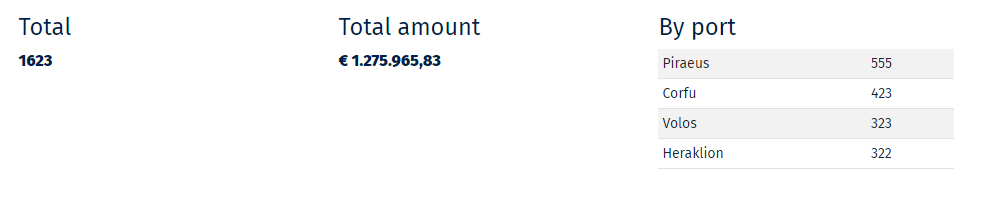

.. image:: https://badge.fury.io/py/django-simple-stats.svg
    :target: https://badge.fury.io/py/django-simple-stats
    
django-simple-stats
-------------------

A django package for creating stats from a query. 
This package should be compatible with all 
Django versions > 3.x

Installation
============

Install it from pip:

``pip install django-simple-stats``

or the latest version from git:

``pip install git+https://github.com/spapas/django-simple-stats``

No other installation is needed.

Stat kinds
==========

* The ``query_aggregate_single`` / ``QueryAggregateSingleStat``  will run the aggregate function on a field and return a single value. For example you can get the total  number of rows of your query or the sum of all fields. 

* The ``query_aggregate`` / ``QueryAggregateStat`` will run the aggregate function on a field and return the list of values. You can run the aggregate function *on a different field* by passing ``aggr_field`` (so you can group by a field and return the sum of another field for each group). This is mainly useful for foreign keys and if you've got distinct values in your queries. For example count the number of rows per user. Also it is useful for booleans for example to get the number of rows that have a flag turned on and off. 

* The ``choice_aggregate``  / ``ChoiceAggregateStat`` is similar to the ``query_aggregate`` but will use a ``choices`` attribute to return better looking values. This will not return Null values

* The ``choice_aggregate_with_null`` / ``ChoiceAggregateNullStat`` is the same as ``choice_aggregate`` but will return Null values (so you can add a ``(None, "Empty")`` choice to your choices)

* The ``query_aggregate_date`` / ``QueryAggregateDateStat`` is similar to the ``query_aggregate`` but will return the aggregates on a specific date field; use ``what`` to pass ``year``, ``month``, ``day``.

* Finally, the ``query_aggregate_buckets`` // ``QueryAggregateBucketsStat`` is used to create buckets of values. You'll pass the list of buckets and the query will  return the results that belong in each bucket. The stats module will run individual queries with ``field__gte`` for each value. So for example if you pass ``[100, 50, 10]`` and you have a field ``price`` it will run ``price__gte=100``, ``price__gte=50``, ``price__gte=10`` and return the results.

Usage
=====

Both a declarative (similar to how Django models/forms work) and a functional API can be used.

For the declarative API, you need to declare a class inheriting from ``simple_stats.StatSet`` and
declare the stats fields in it using the corresponding stats classes like ``simple_stats.QueryAggregateStat``.
Then you'll initialize this class in your Django view passing it the query. For example:

.. code-block:: python

    from simple_stats import StatSet, QueryAggregateSingleStat
    
    class MyStats(StatSet):
        id = QueryAggregateSingleStat(label='Total number')
    
    # Then in your view
    stats = MyStats(query=MyModel.objects.all())

The stats classes take the following initialization parameters:

* field (optional): The field that the aggreate will run on; use ``__`` for joins i.e ``fiedld1__field2``
* label (optional): The textual description of this statistic (will be filled with the field if not passed)
* method (optional): The aggregate method. Can be one of ``count``, ``sum``, ``max``, ``min``, ``avg``. Default is count
* what (optional): Only required for ``query_aggregate_date``, it is eithed ``year``, ``month``, ``day``
* choices (optional): Only required for ``choice_aggregate`` and ``choice_aggregate_with_null``, it must be a django choices list 
* buckets (optional): Only required for ``query_aggregate_buckets``. Must be a list from the biggest to the lowest value.
* aggr_field (optional): This field is optional and can be used for ``query_aggregate``, ``query_aggregate_date``, ``choice_aggregate`` and ``choice_aggregate_with_null``. It denotes a field that would run the aggregate function on.
* formatter (optional): A callback that can be used to format the value, it should get a value and return a rendered value (i.e ``lambda v: "${}".format(v)``)

Please notice that if you don't pass the ``field`` parameter then the name of the attribute will be used (i.e. it will be 
``field=id`` in the example above).

The ``StatSet`` instance will be an enumerable returning a list of dictionaries with the following attributes:

* label: Same as the label in the configuration
* value: Will have a value if you use the query_aggregate_single, else will be None 
* values: Will be empty for query_aggregate_single else will be a list of tuples. Each tuple will have two elements, ``(label, value)``

On the other hand, the only supported method in the functional API the ``simple_stats.get_stats``. 
It expects a django query and the stats configuration (list of dicts). 
Each element of the configuration list is a dictionary that has the same attributes as the init parameters
for the class. There are only two differences:

* The field is now required 
* We must pass the kind of aggregate we need (similar to the class we used on the declarative API). Choices here are: ``query_aggregate_single``, ``query_aggregate``, ``choice_aggregate``, ``choice_aggregate_with_null``, ``query_aggregate_date``, ``query_aggregate_buckets``. 

See below for a complete example.

The response will be a list of dictionaries with the same attributes as the ``StatSet`` instance.

Please notice that the declarative api will create a dictionary and actually call the ``get_stats``
function so in both cases the result will be exactly the same.

Example declarative
===================

Please remember in the example below that if you don't pass the ``field`` parameter then the name of the 
attribute will be used. Also by default the ``method`` is ``count``.

.. code-block:: python

    from simple_stats import from simple_stats import (
        StatSet,
        QueryAggregateStat,
        QueryAggregateSingleStat,
        ChoiceAggregateStat,
        QueryAggregateDateStat,
        QueryAggregateBucketsStat,
    )

    class MyStats(StatSet):
        id = QueryAggregateSingleStat(label='Total number')
        price = QueryAggregateSingleStat(label='Total price', method='sum')
        pilot_authority__name = QueryAggregateStat(label='Per authority')
        pilot_authority__name = QueryAggregateStat(label='Per authority by price', aggr_field='price')
        status = ChoiceAggregateStat(label='Per status', choices=MyModel.STATUS_CHOICES)
        status_price = ChoiceAggregateStat(
            label='Per status by price', 
            choices=MyModel.STATUS_CHOICES, 
            field='status', 
            aggr_field='price'
            formatter=lambda v: "€ {}".format(v) if v else '-'
        )
        year = QueryAggregateDateStat(label='Per year', what='year', field='created_on')
        year_price = QueryAggregateDateStat(label='Per year by price', what='year', aggr_field='price', field='created_on')
        buckets = QueryAggregateBucketsStat(label='Buckets', buckets=[100, 50, 10])

    def my_view(request):
        qs = TestModel.objects.all()

        stats = MyStats(qs)
        return render(request, 'my_template.html', {'stats': stats})

the ``stats`` result will be an enumerable similar to this one:

.. code-block:: python

  [
    {'label': 'Total', 'values': [], 'value': 1216}, 
    {'label': 'Total price', 'values': [], 'value': 323.16}, 
    {'label': 'Per authority', 'values': [('Authority 1', 200), ('Authority 2', 9),   ], 'value': None}, 
    {'label': 'Per authority by price', 'values': [('Authority 1', 123.23), ('Authority 2', 42.12),   ], 'value': None}, 
    {'label': 'Per status', 'values': [('New', 200), ('Cancel', 0)], 'value': None},
    {'label': 'Per status by price', 'values': [('New', '€ 32.01'), ('Cancel', '€ 44.23')], 'value': None},
    {'label': 'Per year', 'values': [(2021, 582), (2022, 634)], 'value': None}
    {'label': 'Per year by price', 'values': [(2021, 5.82), (2022, 6.34)], 'value': None}
    {'label': 'Per price', 'values': [('> 5000', 1), ('> 1000', 29), ('> 500', 86), ('> 0', 305)], 'value': None}
  ]

  
You can display this in your template using something like this (using bootstrap):

.. code-block:: html

  

    
    

        <h4>{{ s.label }}</h4>
        
            <table class='table table-condensed table-striped small table-sm'>
                
                    <tr>
                        <td>{{ v.0 }}</td>
                        <td>{{ v.1 }}</td>
                    </tr>
                
            </table>
        
            <b>{{ s.value }}</b>
        
    

    
  

Example functional
===================

.. code-block:: python

    from simple_stats import get_stats

    STATS_CFG = cfg = [
            {
                'kind': 'query_aggregate_single',
                'label': 'Total',
                'field': 'id',
            }, {
                'kind': 'query_aggregate_single',
                'label': 'Total price',
                'method': 'sum',
                'field': 'price',
            }, {
                'kind': 'query_aggregate',
                'label': 'Per authority',
                'field': 'pilot_authority__name',
            }, {
                'kind': 'query_aggregate',
                'label': 'Per authority by price',
                'field': 'pilot_authority__name',
                'aggr_field': 'price',
                'formatter': lambda v: "€ {}".format(v) if v else '-'
            }, {
                'kind': 'choice_aggregate',
                'label': 'Per status',
                'field': 'status',
                'choices': models.STATUS_CHOICES,
            }, {
                'kind': 'choice_aggregate',
                'label': 'Per status by price',
                'field': 'status',
                'aggr_field': 'price',
                'choices': models.STATUS_CHOICES,
            }, {
                'kind': 'query_aggregate_date',
                'label': 'Per year',
                'field': 'created_on',
                'what': 'year',
            }, {
                'kind': 'query_aggregate_date',
                'label': 'Per year by price',
                'field': 'created_on',
                'what': 'year',
                'aggr_field': 'price',
            }, {
                'kind': 'query_aggregate_buckets',
                'label': 'Per price',
                'field': 'price',
                'buckets': [100_00, 50_00, 1_000, 500, 0]
            }
        ]

    def my_view(request):
        qs = TestModel.objects.all()

        stats = get_stats(qs, STATS_CFG)
        return render(request, 'my_template.html', {'stats': stats})

The ``stats`` will be an array of dictionaries, similar to the declarative example.

Exporting the stats
===================

You can easily export these stats in xls using the xlwt (https://pypi.org/project/xlwt/) library and this function:

.. code-block:: python

    import xlwt
    
    def create_xls_resp(stats, response):
        context = self.get_context_data()
        import xlwt
        wb = xlwt.Workbook(encoding="utf-8")
        for stat in stats:
            ws = wb.add_sheet(stat["label"][:31])
            ws.write(0,0,stat["label"], xlwt.easyxf('font: name Calibri, bold on', ))
            if stat["value"]:
                ws.write(0,1,stat["value"], xlwt.easyxf('font: name Calibri, bold on', ))

            for i, val in enumerate(stat["values"], start=2):
                for j,v in enumerate(val, start=0):
                    ws.write(i,j,v)
        wb.save(response)

Now you can call it like this from your view:

.. code-block:: python

    from django.http import HttpResponse

    def my_export_view(request):
        qs = TestModel.objects.all()

        stats = get_stats(qs, STATS_CFG)
        response = HttpResponse(content_type="application/ms-excel")
        response["Content-Disposition"] = "attachment; filename=export.xls"
        create_xls_resp(response)
        return response
            

Changelog
=========

* v.0.6.0: Add tests!
* v.0.5.1: Allow adding a formatter for the values
* v.0.5.0: Add declarative API
* v.0.4.0: Allow the aggregate function to run on a different field using ``aggr_field``
* v.0.3.1: Fix small bug with ``choice_aggregate_with_null``
* v.0.3.0: Add ``choice_aggregate_with_null`` and throw if stat kind is not found
* v.0.2.1: Fix small bug with column aliases
* v.0.2.0: Changed API; use ``query_aggregate_datetime`` for a datetime field and ``query_aggregate_date`` for a date field
* v.0.1.0: Initial version
